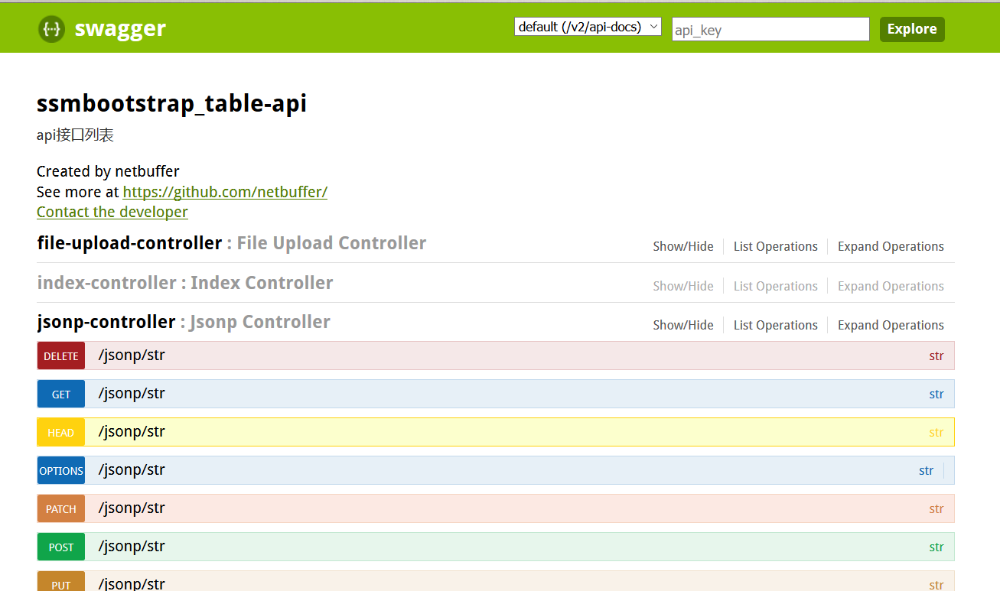

#ssmbootstrap_table demo
## 技术栈
* spring+springmvc+jdbcTemplate
* poi3
* 自定义标签开发
* bootstrap3
* bootstrap-table1.9
* druid
* fastjson
* weui
* log4jdbc
* hibernate-validator
* [spring-jsonp-support](https://github.com/bhagyas/spring-jsonp-support)
* SUI mobile
* springfox (返回controller文档描述,目前使用的版本并不支持fastjson，使用的是Jackson，期待后续版本支持fastjson)

##How to run
项目采用maven构建，运行前请先执行src/main/java下的sql脚本到你的mysql数据库中，然后修改src/main/resource下的jdbc.properties配置文件中的数据库配置信息，进入项目目录，执行mvn tomcat7:run来运行

#
#
# springfox-demo
#
