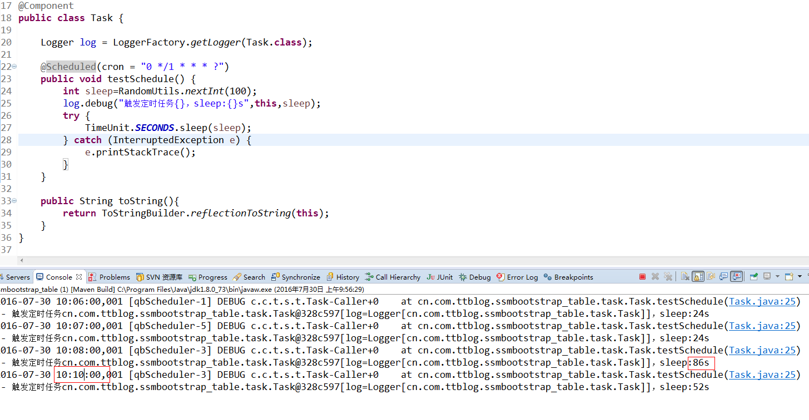
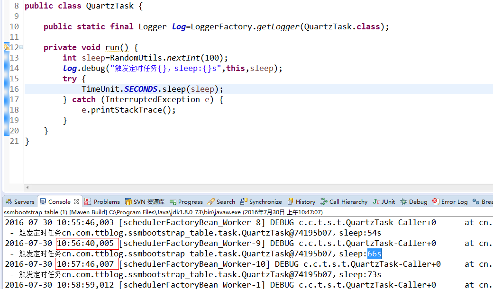

#ssmbootstrap_table demo
## 技术栈
* spring+springmvc+jdbcTemplate
* spring task/quartz
* bootstrap3/bootstrap-table1.9
* druid/fastjson/log4jdbc2
* hibernate-validator

##How to run
项目采用maven构建，运行前请先执行src/main/java下的sql脚本到你的mysql数据库中，然后修改src/main/resource下的jdbc.properties配置文件中的数据库配置信息，进入项目目录，执行mvn tomcat7:run来运行

#
---

#springtask
#

#quartz
#
> 发现quartz持久化到数据库的任务，如果期间改变了job的包名，类名等，需要去数据库中同步修改掉这个任务才行，否则启动会失败