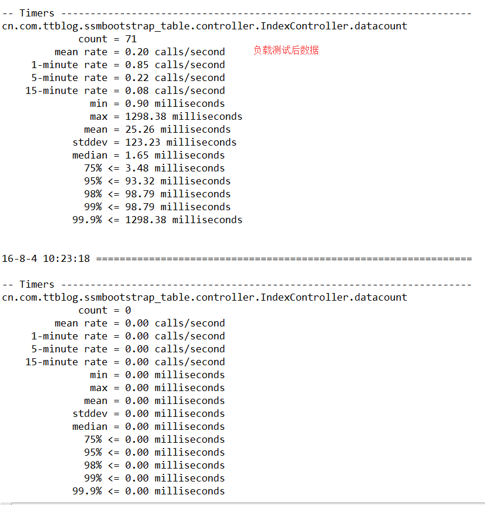
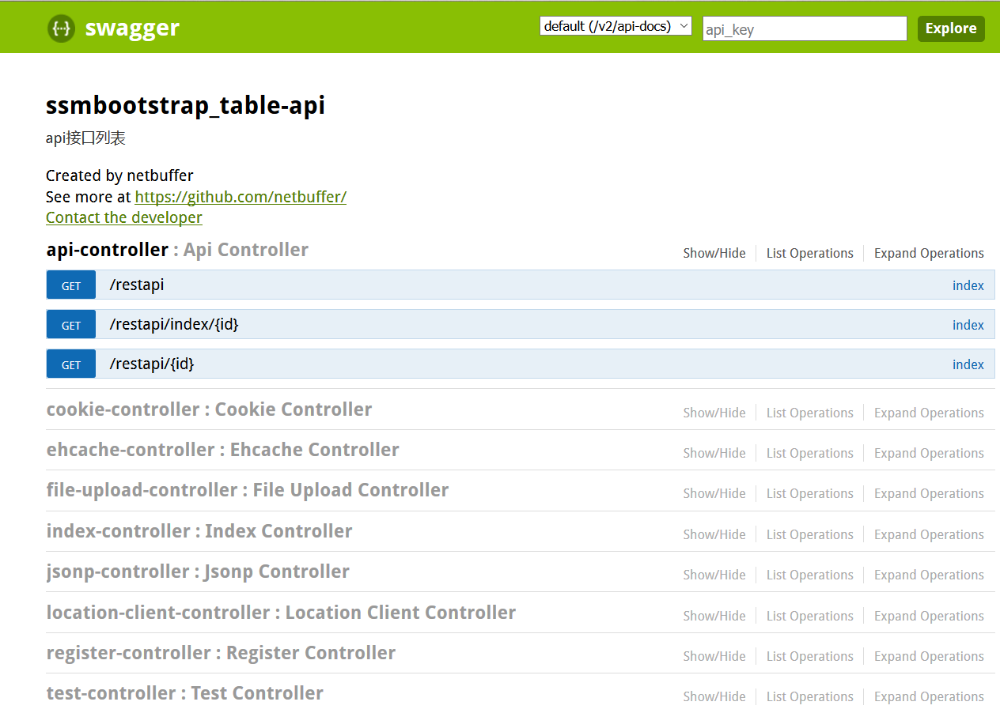

# ssmbootstrap_table demo

## 技术栈/technology stack
* spring+springmvc+mybatis
* poi3
* 自定义标签开发
* bootstrap3/bootstrap-fileinput/jquery.fileupload
* bootstrap-table1.9
* druid
* fastjson
* weui
* log4jdbc/log4jdbc-remix/log4jdbc-log4j2(show sql)
* hibernate-validator
* [spring-jsonp-support](https://github.com/bhagyas/spring-jsonp-support)
* SUI mobile
* lombok
* ehcache
* metrics
* springfox
* spring-websocket
* zxing
* jwebunit
* mockito
* itextpdf

# 微信扫码使用gitee工具

> ## github:[https://github.com/netbuffer/ssmbootstrap_table](https://github.com/netbuffer/ssmbootstrap_table)
> ## git@osc:[https://gitee.com/netbuffer/ssmbootstrap_table](https://gitee.com/netbuffer/ssmbootstrap_table)

## How to run
The project constructed by `maven`, please execute under the `src/main/java` `SQL script` to your `MySQL` database operation, and then modify the database configuration information `jdbc.properties` under the path `src/main/resource` configuration file in the project directory, enter, execute `mvn tomcat7:run` to run

## 运行
项目采用`maven`构建，运行前请先执行`src/main/java`下的`sql`脚本到你的`mysql`数据库中，然后修改`src/main/resource`下的`jdbc.properties`配置文件中的数据库配置信息，进入项目目录，执行`mvn tomcat7:run`来运行

git->clone;eclipse->File->Import->Existing Maven projects，导入到eclipse后，等maven依赖下载完，右键项目，run as->maven build->tomcat7:run

# 

# 

metrics | @Timed
---|---
 | 

# 
---
> 
>   * develop开发分支
>   * cxf test `apache cxf`
>	* JdbcTemplate(test spring `jdbctemplate`/test `shiro`)
>	* springtask(test spring `task`/`quartz`)
>	* velocity(test `velocity` template)
>	* swagger (test `swagger` api doc)

# other projects
> `ssmbt(ssmbootstrap_table maven module )` github:[https://github.com/netbuffer/ssmbt](https://github.com/netbuffer/ssmbt)`/`git@osc:[https://gitee.com/netbuffer/ssmbt](https://gitee.com/netbuffer/ssmbt)

> `sssbootstrap_table(spring+springmvc+spring data jpa)` github:[https://github.com/netbuffer/sssbootstrap_table](https://github.com/netbuffer/sssbootstrap_table)`/`git@osc:[https://gitee.com/netbuffer/sssbootstrap_table](https://gitee.com/netbuffer/sssbootstrap_table)    

> `sshbootstrap_table(spring+struts2+hibernate)` github:[https://github.com/netbuffer/sshbootstrap-table](https://github.com/netbuffer/sshbootstrap-table)`/`git@osc:[https://gitee.com/netbuffer/sshbootstrap-table](https://gitee.com/netbuffer/sshbootstrap-table)    

> `spring-boot-bootstrap_table(springboot)` github:[https://github.com/netbuffer/spring-boot-bootstrap_table](https://github.com/netbuffer/spring-boot-bootstrap_table)`/`git@osc:[https://gitee.com/netbuffer/spring-boot-bootstrap_table](https://gitee.com/netbuffer/spring-boot-bootstrap_table)   

> `jfinal-bootstrap-table(jfinal)`github:[https://github.com/netbuffer/jfinal-bootstrap-table](https://github.com/netbuffer/jfinal-bootstrap-table)`/`git@osc:[http://gitee.com/netbuffer/jfinal-bootstrap-table](http://gitee.com/netbuffer/jfinal-bootstrap-table)  

> `medoo_bootstrap_table(php5)`github:[https://github.com/netbuffer/medoo_bootstrap_table](https://github.com/netbuffer/medoo_bootstrap_table)`/`git@osc:[http://gitee.com/netbuffer/medoo_bootstrap_table](http://gitee.com/netbuffer/medoo_bootstrap_table)