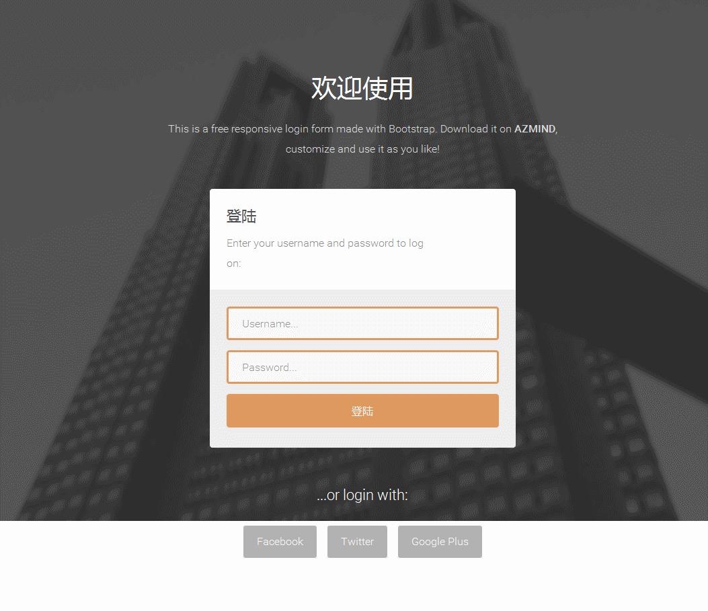

# ssmbootstrap_table demo

## 技术栈/technology stack
* spring+springmvc+mybatis
* poi3
* 自定义标签开发
* bootstrap3/bootstrap-fileinput/jquery.fileupload
* bootstrap-table1.9
* druid
* fastjson
* weui
* log4jdbc/log4jdbc-remix/log4jdbc-log4j2(show sql)
* hibernate-validator
* [spring-jsonp-support](https://github.com/bhagyas/spring-jsonp-support)
* SUI mobile
* lombok
* ehcache
* metrics
* springfox
* spring-websocket
* zxing
* jwebunit
* mockito
* itextpdf

> ## github:[https://github.com/netbuffer/ssmbootstrap_table](https://github.com/netbuffer/ssmbootstrap_table)
> ## git@osc:[http://git.oschina.net/gradle/medoo_bootstrap_table](http://git.oschina.net/gradle/medoo_bootstrap_table)

## How to run
The project constructed by `maven`, please execute under the `src/main/java` `SQL script` to your `MySQL` database operation, and then modify the database configuration information `jdbc.properties` under the path `src/main/resource` configuration file in the project directory, enter, execute `mvn tomcat7:run` to run

## 运行
项目采用`maven`构建，运行前请先执行`src/main/java`下的`sql`脚本到你的`mysql`数据库中，然后修改`src/main/resource`下的`jdbc.properties`配置文件中的数据库配置信息，进入项目目录，执行`mvn tomcat7:run`来运行

git->clone;eclipse->File->Import->Existing Maven projects，导入到eclipse后，等maven依赖下载完，右键项目，run as->maven build->tomcat7:run

#

#

metrics | @Timed
---|---
 | 

#

---
> 
>   * develop开发分支
>	* JdbcTemplate(test spring `jdbctemplate`/test `shiro`)
>	* springtask(test spring `task`/`quartz`)
>	* velocity(test `velocity` template)
>	* swagger (test `swagger` api doc)
